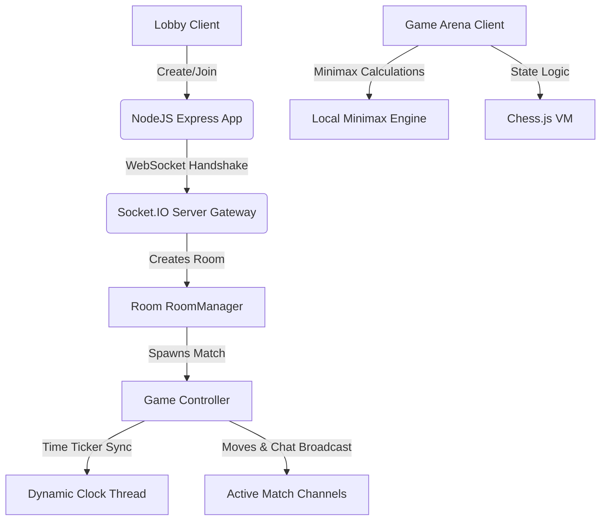

# Kingside — Premium Real-Time Chess Platform

Kingside is a high-performance, responsive chess console designed for real-time multiplayer matchmaking, spectator observation, and local engine training. Built on standard systems APIs with zero reliance on bulky client-side frameworks, it features a custom lock-free socket-room scheduler, dynamic vector piece skins, and browser-compiled positional minimax heuristics.

## Technical Architecture



## Key Capabilities

- **Match lobby**: Instantly create games with distinct time constraints (Blitz, Rapid, Classical, Unlimited) or join using 6-digit room codes.
- **Dynamic evaluation bar**: In-browser centipawn evaluation updates instantly after every move, rendering positional advantages visually.
- **Minimax engine bot**: Practice offline against depth-3 minimax heuristics with alpha-beta pruning, optimized positional weighting matrices, and side-swapping rematches.
- **Spectator mode**: Seamlessly spectate ongoing matches using the room code. Spectators watch matching player badges and clocks tick in real-time without board interaction access.
- **Audio systems customization**: Dynamic move sound effects (classic wood, 8-bit retro, cyber lasers) with check validations and volume slider controls.
- **Responsive viewport design**: Height-based layout queries (`@media max-height`) dynamically scale down the board to guarantee fitting without scrolling on small laptops.

## Technology Stack

- **Server Backend**: Node.js, Express, Socket.IO, UUID.
- **Lobby & Game Frontend**: Semantic HTML5, Vanilla CSS3 (Custom variables, Flex/Grid layouts), JavaScript (ES6).
- **Core Engine VM**: Chess.js (V0.10.3).

## Local Development & Setup

1. **Install Dependencies**:
   ```bash
   npm install
   ```

2. **Launch Application Server**:
   By default, the server listens to port `3005` (fallback configurations protect against clashing with portfolio applications):
   ```bash
   node server/index.js
   ```

3. **Open Browser**:
   Navigate to `http://localhost:3005` to access the lobby console.
